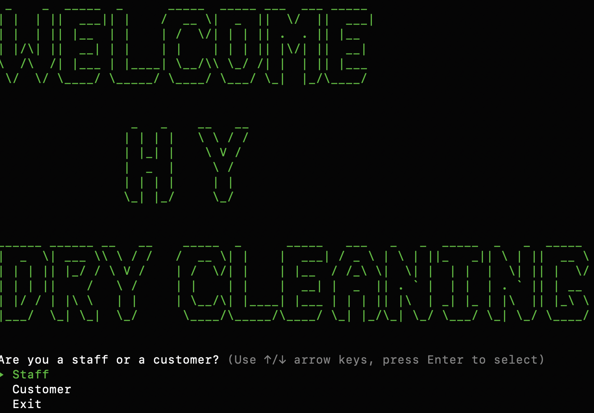
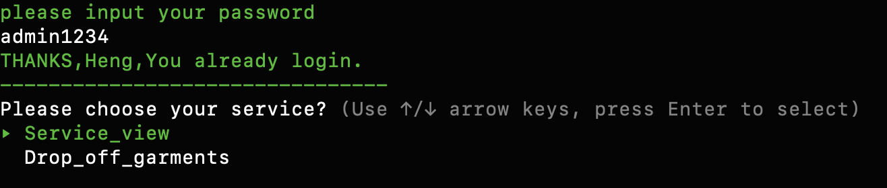
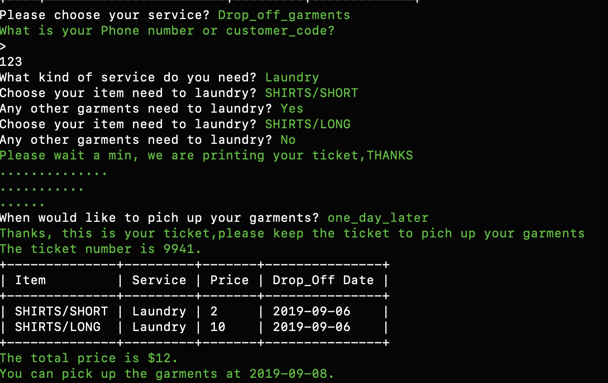
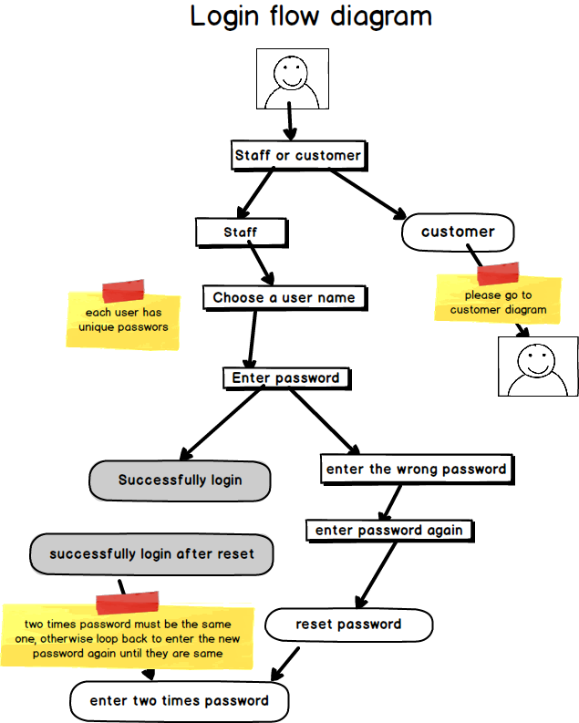
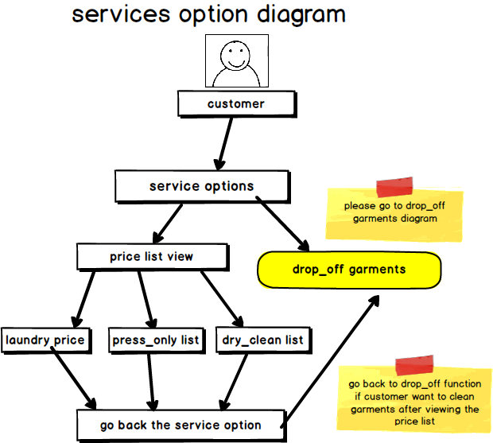
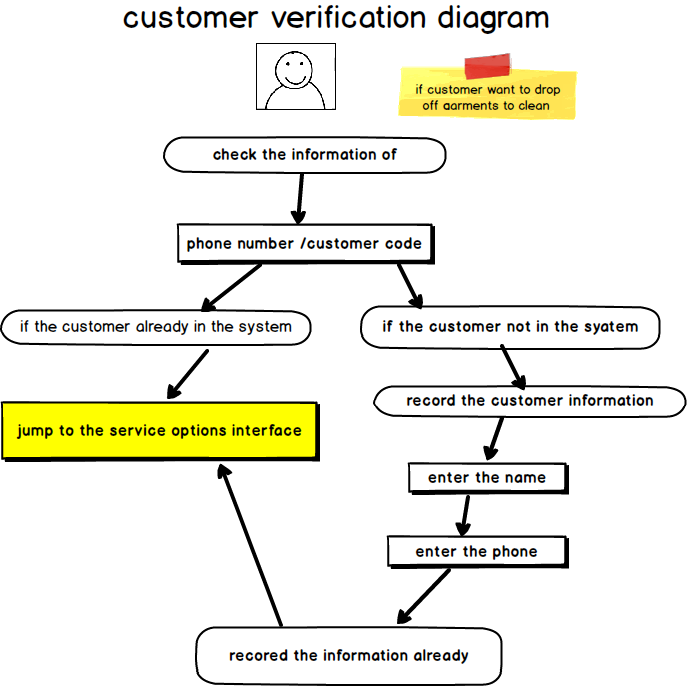
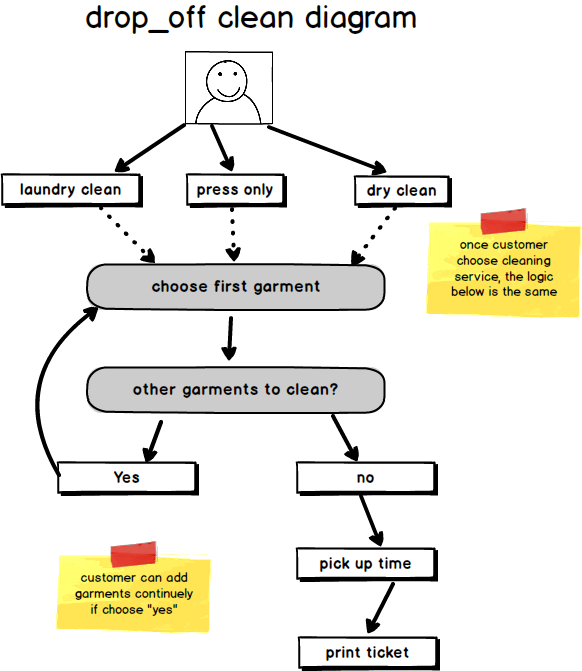
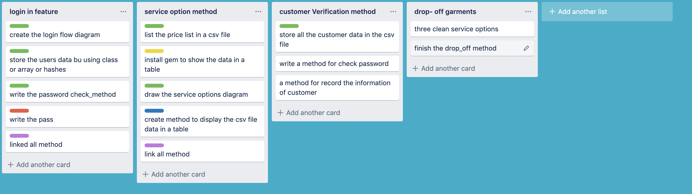

# Terminal Application

## contents
1. Statement of Purpose and Scope
2. Features
3. User Interaction and Experience
4. Control Flow Diagram
5. Implementation Plan
6. Help file
7.
8. Test Application
9. Project Management Plan


## 1.Statement of Purpose and Scope
 * ***Describe at a high level what the application will do***

    The chain dry cleaner management system is used to complete the entry, modification, inquiry and deletion of clothing, members, clerk, administrator, news; complete the statistics of business records; complete the communication platform between administrators and members.

 * ***identify the problem it will solve and explain why you are developing it***

    At present, the management of the laundry industry needs to meet the rapid growth of laundry, which is not enough, because the current dry cleaners mostly use manual or semi-manual treatment of the dry cleaner business process, and manually use the manual method to pick up the clothes at the front desk and semi-manually carry out the turnover statistics. The efficiency is very low. The dry cleaner business mainly focuses on pick-up and clothing, laundry consumables management, laundry equipment management, employee management, and turnover statistics. In addition, in addition to the delivery business, the dry cleaners also have a lot of services for users, such as applying for membership and customers to check the status of clothing. If these internal operations of the dry cleaners are managed by computers, the time of the large dry cleaners and managers can be greatly saved, and the work efficiency can be improved. In today's world, advanced and efficient network management for each chain store can be realized through the network. Through the network, the dry cleaning store head office management staff can conveniently manage the branches, such as branch joining, cost revenue and expenditure management, internal message / notification management, the network-based chain dry cleaner management system can greatly save the management of large dry cleaners. Time to improve work efficiency.

    Software development is a team project. As mentioned above, the dry cleaner management software can help the main manager, the counter, and the customers solve many practical problems. In some small dry cleaners I have observed, they use hand records. Management, a practical and simple application can help them better serve their customers. The app designed this time is logged in from the most basic system. The clerk can use the app to record the customer's laundry quantity, price, and time of putting clothes, etc., to complete some basic functions. Waiting for the supplement of the function....


  * ***identify the target audience***
  
    1. dry cleaning shop.
    2. dry cleaning counter staff.
    3. people need garments to be dry cleaned.

  * ***explain how a member of the target audience will use it***

    The specific installation and use of this appliaction will be specifically described below. Here is a brief description:

    1. The shop counter and manager need to log in with the account and password before using the app. If they forget the password, they can reset the password and log in again.
    2. Customer: There are two main functions:
    * check the price list of laundry,press_only,dry cleaning service.

    * customer can directly choose the option of drop_off garments to clean,once the counter staff   record their garments and date of picking up, the customer will receive a ticket, and they can pick up the garmemnts on the basis of the ticket number on the ticket(the ticket number is very important, the staff will manage all garments according to this number)


    

## 2.Features
  * ***Feature one（login feature）***

    * The login function is designed for the staffs and managers who work in the dry clean shop
    1. Once the application runs, there would be two options(staff or customer),choose the 'staff' option.
    2. The 'staff' has all the user name options to choose, all the users data already stored in a array by the hash data type.
    3. Once staff choose the user name, they need enter their own password(different customers have different passwords),when they enter the password, there would be check_function method to check if the password if correct or not.The staff can login successfully when they enter the right password.
    4. There are two more chances for the staff to enter the password if they enter the wrong one
    5. Once they wrongly enter the password three time, the application will call a reset_password method to let the staff reset the password.
    6. The method will let the staff type two times new password to make sure they reset the new password successfully.
    7. Once tyey enter reset the password successfully, the application interface will automatically jump to the main service interface.

  * ***Feature two (price list viewing)***
  * this feature is for the staff and the customers
    1. All the garments price data are stored in the csv file the staff can change the price according to this file.
    2. The customers can check the price list with this feature.

    *below are details about this feature.
    1. once the customer choose the price_list_view option, there are three options(laundry,press_only,dry_clean) to choose. please type anyone you would like to check.
    3. The data in every single list already stored in csv file.There is a method which can get the data from the csv file and change to table by using the gem terminal table.
    4. Once the customer viewed one of the price lists, they can go back to the main menu according to pressing 'Enter' , then they can choose to check the other service price list.

  * ***Feature two (Drop_off_garments)***
    * This feature is mainly for the staff to record all the information about the garments, and also print a ticket to the customer.
    1. Firstly, the staff need ask the customer's phone number or customer code.If customer already been this shop before, their information already been recorded in our system. Then we can directly find customer's information.
    2. If the customer enter a phone number or a customer code which does not exist in our system, the application will need recored their information first.
    3. After the customer provide the name and phone number, their information will be stored in a customer array, after that, they can use the drop_off service.
    4. Once the staff find the customer information , customer can drop off garments to clean. There are three options to choose(laundry, press_only,dry_clean)
    5. There is a loop method to set to keep asking the customer if they have other garments need to dry clean(They need enter the gatmemts one by one )
    6. After the customer enter all the garments they need to clean.The staff will ask the customer when they would like to pick up their garments.
    7. Last, There is a method would record all the information such as the garments, the total price,the drop_off date and pick_up date.Then print them into a table(ticket).


## 3.User Interaction and Experience

* ***Login Interface***
    * Choose you are a staff 
    * Choose the user name
    * Enter the password 
    * If password passed, login successfully
    * If password wrong, keep entering the password
    * If enter the password wrongly three times, go to reset password
    * After reset the password, login successfully



* ***Service Interface***
    * Choose the price list option
    * After viewed the price list, you can go back to choose service again


* ***Customer Verification Interface***

    * Customer enter the phone number or customer code
    * If information exist, go to choose clean service
    * If information not exist, go to add new customer
    * After recorded successfully, go to drop off garments



## 4.Control Flow Diagram

* ***Login Flow Diagram***
    
    

* ***Service option Flow Diagram***

    

* ***Customer Verfication Flow Diagram***

    

* ***Drop Off Garments Flow Diagram***

    


##5.Project Management Plan
    


## 6.Help File

* ***Below are steps to run the application***

1. Make sure you have ruby installed on your machine. I use the rbenv. This required homebrew.

2. clone the repository from the github.Here is the link:
```txt
https://github.com/Caiheng111/terminal-application
```

```txt
git clone name.git
```

```txt
'cd' into your directory you've cloned
```

3. run the build.sh file to install everything
```txt
run the 'build shell' in the ternamial 
```
4. Run the follow command 
```txt
run app.rb
```


